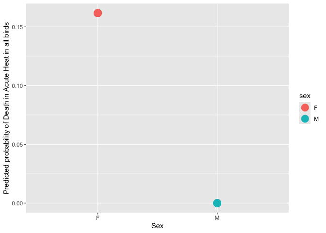
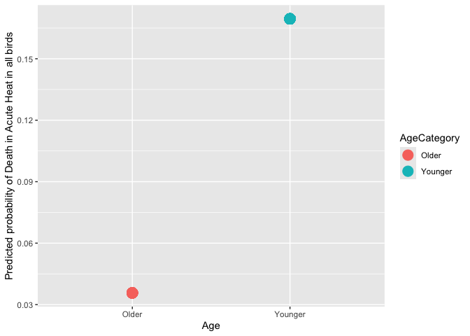
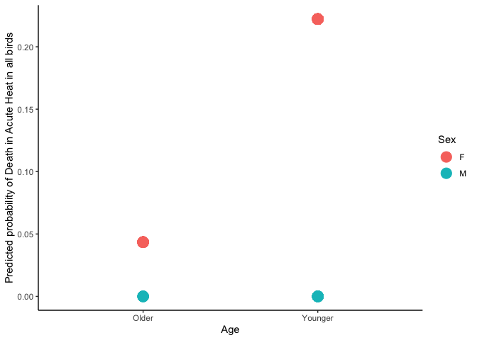
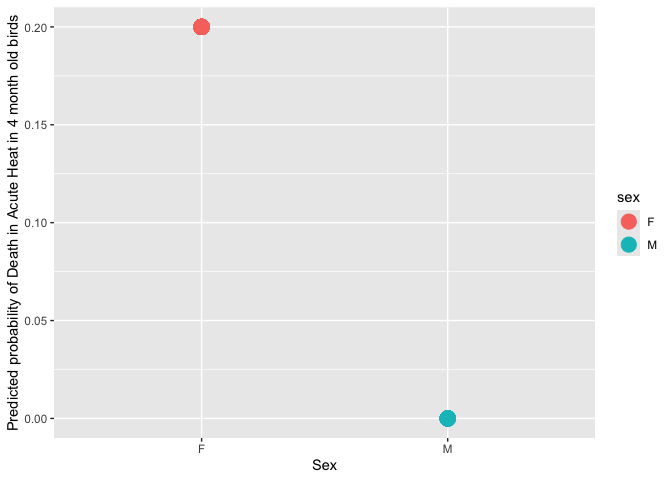

<https://github.com/StatQuest/logistic_regression_demo/blob/master/logistic_regression_demo.R>
\###Read in main data files

``` r
library(multcomp)
library(ggplot2)
library(nlme)
library(grid)
library(gridExtra)
library(emmeans)
library(cowplot)
library(ggplot2)
```

# Read in the data

``` r
data=read.csv("AHDB_MasterDataSheet.csv")
data
```

    ##    AgeCategory ID_Band Sex Treatment Died_InTrt Treatment_Category
    ## 1      Younger    4741   F         B          0               Heat
    ## 2      Younger    4703   F         B          0               Heat
    ## 3      Younger    4712   F         B          0               Heat
    ## 4      Younger    4787   M         B          0               Heat
    ## 5      Younger    4791   M         B          0               Heat
    ## 6      Younger    4783   M         B          0               Heat
    ## 7      Younger    4757   M         B          0               Heat
    ## 8        Older    4593   M         B          0               Heat
    ## 9        Older    4534   F         B          0               Heat
    ## 10     Younger    4792   F         B          0               Heat
    ## 11     Younger    4769   M         B          0               Heat
    ## 12       Older    4600   M         B          0               Heat
    ## 13       Older    4614   M         B          0               Heat
    ## 14     Younger    4816   M         B          0               Heat
    ## 15     Younger    4778   M         B          0               Heat
    ## 16     Younger    4797   F         B          0               Heat
    ## 17       Older    4613   M         B          0               Heat
    ## 18     Younger    4788   M         B          0               Heat
    ## 19       Older    4620   F         B          0               Heat
    ## 20     Younger    4771   M         B          0               Heat
    ## 21     Younger    4764   M         B          0               Heat
    ## 22     Younger    4725   M         B          0               Heat
    ## 23     Younger    4800   M         B          0               Heat
    ## 24     Younger    4803   M         B          0               Heat
    ## 25     Younger    4809   F         B          0               Heat
    ## 26     Younger    4804   M         B          0               Heat
    ## 27       Older    4531   F         B          1               Heat
    ## 28     Younger    4768   F         B          1               Heat
    ## 29     Younger    4761   F         B          1               Heat
    ## 30     Younger    4774   F         B          1               Heat
    ## 31     Younger    4802   F         B          1               Heat
    ## 32     Younger    4810   F         B          1               Heat
    ## 33     Younger    4817   F         B          1               Heat
    ## 34       Older    4529   F         C          0               Heat
    ## 35     Younger    4704   F         C          0               Heat
    ## 36       Older    4715   F         C          0               Heat
    ## 37       Older    4608   F         C          0               Heat
    ## 38       Older    4559   M         C          0               Heat
    ## 39     Younger    4782   F         C          0               Heat
    ## 40     Younger    4748   F         C          0               Heat
    ## 41     Younger    4717   F         C          0               Heat
    ## 42       Older    4561   F         C          0               Heat
    ## 43     Younger    4731   F         C          0               Heat
    ## 44       Older    4554   F         C          0               Heat
    ## 45       Older    4601   F         C          0               Heat
    ## 46     Younger    4814   F         C          0               Heat
    ## 47       Older    4586   F         C          0               Heat
    ## 48     Younger    4776   F         C          0               Heat
    ## 49     Younger    4805   F         C          0               Heat
    ## 50     Younger    4775   F         C          1               Heat
    ## 51     Younger    4737   F         C          1               Heat
    ## 52       Older    4530   F         D          0               Heat
    ## 53     Younger    4759   F         D          0               Heat
    ## 54       Older    4551   F         D          0               Heat
    ## 55     Younger    4749   F         D          0               Heat
    ## 56       Older    4573   F         D          0               Heat
    ## 57       Older    4578   F         D          0               Heat
    ## 58       Older    4604   F         D          0               Heat
    ## 59     Younger    4723   F         D          0               Heat
    ## 60     Younger    4735   F         D          0               Heat
    ## 61     Younger    4719   F         D          1               Heat
    ## 62       Older    4562   F         D          0               Heat
    ## 63     Younger    4729   F         D          0               Heat
    ## 64     Younger    4795   F         D          0               Heat
    ## 65       Older    4621   F         D          0               Heat
    ## 66     Younger    4773   F         D          0               Heat
    ## 67     Younger    4752   F         D          0               Heat
    ## 68     Younger    4765   F         D          0               Heat
    ## 69     Younger    4798   F         D          1               Heat
    ## 70     Younger    4739   F         E          0               Heat
    ## 71     Younger    4745   F         E          0               Heat
    ## 72     Younger    4785   F         E          0               Heat
    ## 73     Younger    4784   F         E          0               Heat
    ## 74     Younger    4758   F         E          0               Heat
    ## 75       Older    4533   F         E          0               Heat
    ## 76       Older    4579   F         E          0               Heat
    ## 77     Younger    4738   F         E          0               Heat
    ## 78     Younger    4582   F         E          0               Heat
    ## 79       Older    4535   F         E          0               Heat
    ## 80     Younger    4777   F         E          0               Heat
    ## 81     Younger    4720   F         E          0               Heat
    ## 82       Older    4612   F         E          0               Heat
    ## 83       Older    4548   F         E          0               Heat
    ## 84     Younger    4625   F         E          0               Heat
    ## 85       Older    4619   F         E          0               Heat
    ## 86     Younger    4772   F         E          0               Heat
    ## 87     Younger    4766   F         E          0               Heat

``` r
xtabs(~ Died_InTrt + Sex, data=data) # Summarize the number of deaths by Sex
```

    ##           Sex
    ## Died_InTrt  F  M
    ##          0 57 19
    ##          1 11  0

``` r
xtabs(~ Died_InTrt + AgeCategory, data=data) # Summarize the number of deaths by Age
```

    ##           AgeCategory
    ## Died_InTrt Older Younger
    ##          0    27      49
    ##          1     1      10

# Run generalized linear model for Sex

``` r
logistic <- glm(Died_InTrt ~ Sex, data=data, family="binomial")
summary(logistic)
```

    ## 
    ## Call:
    ## glm(formula = Died_InTrt ~ Sex, family = "binomial", data = data)
    ## 
    ## Deviance Residuals: 
    ##      Min        1Q    Median        3Q       Max  
    ## -0.59406  -0.59406  -0.59406  -0.00013   1.90872  
    ## 
    ## Coefficients:
    ##              Estimate Std. Error z value Pr(>|z|)    
    ## (Intercept)   -1.6452     0.3293  -4.996 5.87e-07 ***
    ## SexM         -16.9209  1496.3960  -0.011    0.991    
    ## ---
    ## Signif. codes:  0 '***' 0.001 '**' 0.01 '*' 0.05 '.' 0.1 ' ' 1
    ## 
    ## (Dispersion parameter for binomial family taken to be 1)
    ## 
    ##     Null deviance: 66.043  on 86  degrees of freedom
    ## Residual deviance: 60.192  on 85  degrees of freedom
    ## AIC: 64.192
    ## 
    ## Number of Fisher Scoring iterations: 17

``` r
female.log.odds <- log(9 / 36)
female.log.odds
```

    ## [1] -1.386294

``` r
male.log.odds <- log(0 / 18)
male.log.odds
```

    ## [1] -Inf

# Now calculate the overall “Pseudo R-squared” and its p-value for Sex

``` r
## NOTE: Since we are doing logistic regression...
## Null devaince = 2*(0 - LogLikelihood(null model))
##               = -2*LogLikihood(null model)
## Residual deviacne = 2*(0 - LogLikelihood(proposed model))
##                   = -2*LogLikelihood(proposed model)
ll.null <- logistic$null.deviance/-2
ll.proposed <- logistic$deviance/-2
 
## McFadden's Pseudo R^2 = [ LL(Null) - LL(Proposed) ] / LL(Null)
(ll.null - ll.proposed) / ll.null
```

    ## [1] 0.08859916

``` r
## chi-square value = 2*(LL(Proposed) - LL(Null))
## p-value = 1 - pchisq(chi-square value, df = 2-1)
1 - pchisq(2*(ll.proposed - ll.null), df=1)
```

    ## [1] 0.01556518

``` r
1 - pchisq((logistic$null.deviance - logistic$deviance), df=1)
```

    ## [1] 0.01556518

## Lastly, let’s see what this logistic regression predicts, given that an individual is either female or male (and no other data about them).

``` r
predicted.data_sex <- data.frame(
  probability.of.Data=logistic$fitted.values,
  sex=data$Sex)
 
## We can plot the data...
ggplot(data=predicted.data_sex, aes(x=sex, y=probability.of.Data)) +
  geom_point(aes(color=sex), size=5) +
  xlab("Sex") +
  ylab("Predicted probability of Death in Acute Heat in all birds")
```

<!-- -->

``` r
## Since there are only two probabilities (one for females and one for males),
## we can use a table to summarize the predicted probabilities.
xtabs(~ probability.of.Data + sex, data=predicted.data_sex)
```

    ##                       sex
    ## probability.of.Data     F  M
    ##   8.64686924501238e-09  0 19
    ##   0.161764705882353    68  0

# Run a generalized linear model for Age

``` r
logistic2 <- glm(Died_InTrt ~ AgeCategory, data=data, family="binomial")
summary(logistic2)
```

    ## 
    ## Call:
    ## glm(formula = Died_InTrt ~ AgeCategory, family = "binomial", 
    ##     data = data)
    ## 
    ## Deviance Residuals: 
    ##     Min       1Q   Median       3Q      Max  
    ## -0.6095  -0.6095  -0.6095  -0.2697   2.5816  
    ## 
    ## Coefficients:
    ##                    Estimate Std. Error z value Pr(>|z|)   
    ## (Intercept)          -3.296      1.018  -3.236  0.00121 **
    ## AgeCategoryYounger    1.707      1.076   1.586  0.11267   
    ## ---
    ## Signif. codes:  0 '***' 0.001 '**' 0.01 '*' 0.05 '.' 0.1 ' ' 1
    ## 
    ## (Dispersion parameter for binomial family taken to be 1)
    ## 
    ##     Null deviance: 66.043  on 86  degrees of freedom
    ## Residual deviance: 62.328  on 85  degrees of freedom
    ## AIC: 66.328
    ## 
    ## Number of Fisher Scoring iterations: 6

# Now calculate the overall “Pseudo R-squared” and its p-value for Age

``` r
## NOTE: Since we are doing logistic regression...
## Null devaince = 2*(0 - LogLikelihood(null model))
##               = -2*LogLikihood(null model)
## Residual deviacne = 2*(0 - LogLikelihood(proposed model))
##                   = -2*LogLikelihood(proposed model)
ll.null <- logistic2$null.deviance/-2
ll.proposed <- logistic2$deviance/-2
 
## McFadden's Pseudo R^2 = [ LL(Null) - LL(Proposed) ] / LL(Null)
(ll.null - ll.proposed) / ll.null
```

    ## [1] 0.05625529

``` r
## chi-square value = 2*(LL(Proposed) - LL(Null))
## p-value = 1 - pchisq(chi-square value, df = 2-1)
1 - pchisq(2*(ll.proposed - ll.null), df=1)
```

    ## [1] 0.05391723

``` r
1 - pchisq((logistic2$null.deviance - logistic2$deviance), df=1)
```

    ## [1] 0.05391723

# Lastly, let’s see what this logistic regression predicts, given that an individual is either younger or older (and no other data about them).

``` r
predicted.data_Age <- data.frame(
  probability.of.Data=logistic2$fitted.values,
  AgeCategory=data$AgeCategory)
 
## We can plot the data...
ggplot(data=predicted.data_Age, aes(x=AgeCategory, y=probability.of.Data)) +
  geom_point(aes(color=AgeCategory), size=5) +
  xlab("Age") +
  ylab("Predicted probability of Death in Acute Heat in all birds")
```

<!-- -->

``` r
## Since there are only two probabilities (one for females and one for males),
## we can use a table to summarize the predicted probabilities.
xtabs(~ probability.of.Data + AgeCategory, data=predicted.data_Age)
```

    ##                     AgeCategory
    ## probability.of.Data  Older Younger
    ##   0.0357142857142918    28       0
    ##   0.169491525423729      0      59

# Run a generalized linear model for Sex and Age

``` r
logistic_Age_Sex <- glm(Died_InTrt ~ AgeCategory + Sex, data=data, family="binomial")
summary(logistic_Age_Sex)
```

    ## 
    ## Call:
    ## glm(formula = Died_InTrt ~ AgeCategory + Sex, family = "binomial", 
    ##     data = data)
    ## 
    ## Deviance Residuals: 
    ##      Min        1Q    Median        3Q       Max  
    ## -0.70896  -0.70896  -0.29817  -0.00009   2.50419  
    ## 
    ## Coefficients:
    ##                    Estimate Std. Error z value Pr(>|z|)   
    ## (Intercept)          -3.091      1.022  -3.023   0.0025 **
    ## AgeCategoryYounger    1.838      1.084   1.697   0.0898 . 
    ## SexM                -17.999   2388.807  -0.008   0.9940   
    ## ---
    ## Signif. codes:  0 '***' 0.001 '**' 0.01 '*' 0.05 '.' 0.1 ' ' 1
    ## 
    ## (Dispersion parameter for binomial family taken to be 1)
    ## 
    ##     Null deviance: 66.043  on 86  degrees of freedom
    ## Residual deviance: 55.900  on 84  degrees of freedom
    ## AIC: 61.9
    ## 
    ## Number of Fisher Scoring iterations: 18

# Now calculate the overall “Pseudo R-squared” and its p-value for sex and age

``` r
## NOTE: Since we are doing logistic regression...
## Null devaince = 2*(0 - LogLikelihood(null model))
##               = -2*LogLikihood(null model)
## Residual deviacne = 2*(0 - LogLikelihood(proposed model))
##                   = -2*LogLikelihood(proposed model)
ll.null <- logistic_Age_Sex$null.deviance/-2
ll.proposed <- logistic_Age_Sex$deviance/-2
 
## McFadden's Pseudo R^2 = [ LL(Null) - LL(Proposed) ] / LL(Null)
(ll.null - ll.proposed) / ll.null
```

    ## [1] 0.1535734

``` r
## chi-square value = 2*(LL(Proposed) - LL(Null))
## p-value = 1 - pchisq(chi-square value, df = 2-1)
1 - pchisq(2*(ll.proposed - ll.null), df=1)
```

    ## [1] 0.001448954

``` r
1 - pchisq((logistic_Age_Sex$null.deviance - logistic_Age_Sex$deviance), df=1)
```

    ## [1] 0.001448954

## Lastly, let’s see what this logistic regression predicts, given that an individual is either younger female, older female, younger male, or older male (and no other data about them).

``` r
predicted.data_Age_Sex <- data.frame(
  probability.of.Data=logistic_Age_Sex$fitted.values,
  AgeCategory=data$AgeCategory, Sex=data$Sex)
 
## We can plot the data...
ggplot(data=predicted.data_Age_Sex, aes(x=AgeCategory, y=probability.of.Data, fill=Sex)) +
  geom_point(aes(color=Sex), size=5) +
  xlab("Age") +
  ylab("Predicted probability of Death in Acute Heat in all birds")
```

<!-- -->

``` r
## Since there are only two probabilities (one for females and one for males),
## we can use a table to summarize the predicted probabilities.
xtabs(~ probability.of.Data + AgeCategory + Sex, data=predicted.data_Age_Sex)
```

    ## , , Sex = F
    ## 
    ##                       AgeCategory
    ## probability.of.Data    Older Younger
    ##   6.93202813993879e-10     0       0
    ##   4.35727481485329e-09     0       0
    ##   0.0434782608695653      23       0
    ##   0.222222222222222        0      45
    ## 
    ## , , Sex = M
    ## 
    ##                       AgeCategory
    ## probability.of.Data    Older Younger
    ##   6.93202813993879e-10     5       0
    ##   4.35727481485329e-09     0      14
    ##   0.0434782608695653       0       0
    ##   0.222222222222222        0       0

# Read in the data - Younger animals only

``` r
YoungerData=read.csv("Younger.csv")
xtabs(~ Died_InTrt + Sex, data=YoungerData)
```

    ##           Sex
    ## Died_InTrt  F  M
    ##          0 36 14
    ##          1  9  0

# Run a generalized linear model for sex in the dataframe only containing younger individuals

``` r
logistic3 <- glm(Died_InTrt ~ Sex, data=YoungerData, family="binomial")
summary(logistic3)
```

    ## 
    ## Call:
    ## glm(formula = Died_InTrt ~ Sex, family = "binomial", data = YoungerData)
    ## 
    ## Deviance Residuals: 
    ##      Min        1Q    Median        3Q       Max  
    ## -0.66805  -0.66805  -0.66805  -0.00013   1.79412  
    ## 
    ## Coefficients:
    ##              Estimate Std. Error z value Pr(>|z|)    
    ## (Intercept)   -1.3863     0.3727   -3.72 0.000199 ***
    ## SexM         -17.1798  1743.2485   -0.01 0.992137    
    ## ---
    ## Signif. codes:  0 '***' 0.001 '**' 0.01 '*' 0.05 '.' 0.1 ' ' 1
    ## 
    ## (Dispersion parameter for binomial family taken to be 1)
    ## 
    ##     Null deviance: 50.397  on 58  degrees of freedom
    ## Residual deviance: 45.036  on 57  degrees of freedom
    ## AIC: 49.036
    ## 
    ## Number of Fisher Scoring iterations: 17

``` r
Youngfemale.log.odds <- log(9 / 36)
Youngfemale.log.odds
```

    ## [1] -1.386294

``` r
Youngmale.log.odds <- log(0 / 18)
Youngmale.log.odds
```

    ## [1] -Inf

# Now calculate the overall “Pseudo R-squared” and its p-value for younger individuals by sex

``` r
 ## NOTE: Since we are doing logistic regression...
## Null devaince = 2*(0 - LogLikelihood(null model))
##               = -2*LogLikihood(null model)
## Residual deviacne = 2*(0 - LogLikelihood(proposed model))
##                   = -2*LogLikelihood(proposed model)
ll.null <- logistic3$null.deviance/-2
ll.proposed <- logistic3$deviance/-2
 
## McFadden's Pseudo R^2 = [ LL(Null) - LL(Proposed) ] / LL(Null)
(ll.null - ll.proposed) / ll.null
```

    ## [1] 0.1063724

``` r
## chi-square value = 2*(LL(Proposed) - LL(Null))
## p-value = 1 - pchisq(chi-square value, df = 2-1)
1 - pchisq(2*(ll.proposed - ll.null), df=1)
```

    ## [1] 0.02059365

``` r
1 - pchisq((logistic3$null.deviance - logistic3$deviance), df=1)
```

    ## [1] 0.02059365

# Lastly, let’s see what this logistic regression predicts.

``` r
predicted.data <- data.frame(
  probability.of.YoungerData=logistic3$fitted.values,
  sex=YoungerData$Sex)
 
## We can plot the data...
ggplot(data=predicted.data, aes(x=sex, y=probability.of.YoungerData)) +
  geom_point(aes(color=sex), size=5) +
  xlab("Sex") +
  ylab("Predicted probability of Death in Acute Heat in 4 month old birds")
```

<!-- -->

``` r
## Since there are only two probabilities (one for females and one for males),
## we can use a table to summarize the predicted probabilities.
xtabs(~ probability.of.YoungerData + sex, data=predicted.data)
```

    ##                           sex
    ## probability.of.YoungerData  F  M
    ##        8.6468692450059e-09  0 14
    ##        0.2                 45  0
