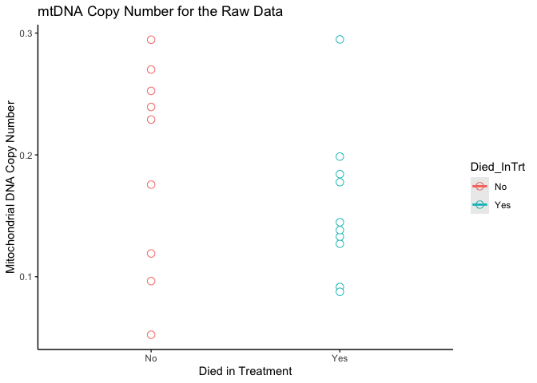
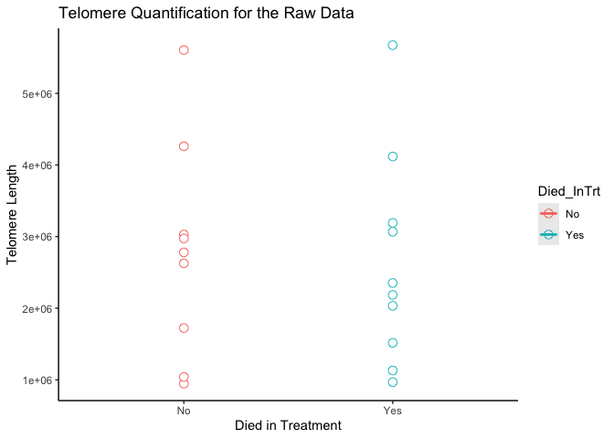
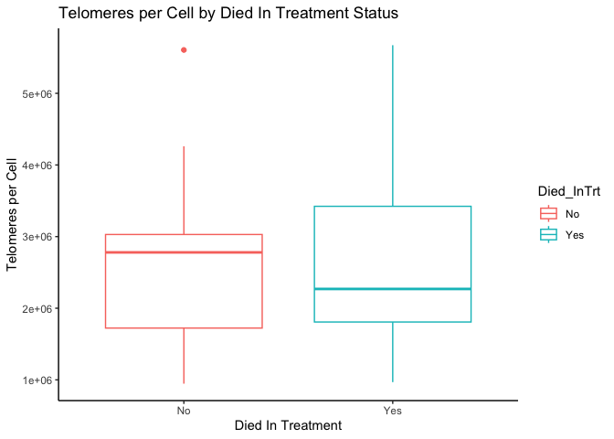
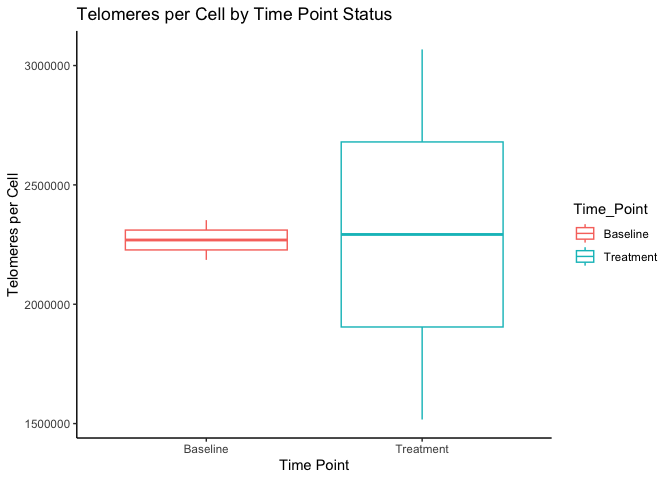
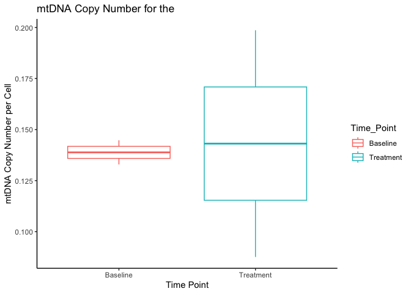
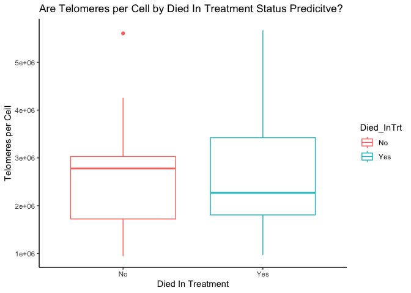
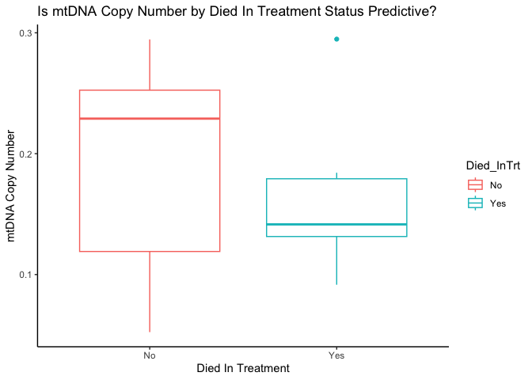

## R Markdown

This is an R Markdown document. Markdown is a simple formatting syntax
for authoring HTML, PDF, and MS Word documents. For more details on
using R Markdown see <http://rmarkdown.rstudio.com>.

This R Markdown is for the analysis of telomere length and mtDNA copy
number qPCR data. This data is from baseline blood samples taken 14 days
prior to an acute heat stress event (43°C for 5 hours). This dataset
contains samples from individuals that survived this treatment, as well
as individuals that died. We are testing whether telomere length and/or
mtDNA copy number were predicitve of this future fate.

### Prepare the data for analysis

# Import qPCR output for each plate 1) the Single Copy Autosomal Gene (EEF2) and mtDNA gene multiplex and 2) the Telomere reaction.

``` r
SCNAG <- read.csv("Manuscript1_DEATH_SCNAG_2025-04-20 19-13-14_795BR20744 -  Quantification Cq Results.csv")

Telo <- read.csv("Manuscript1_DEATH_Telo_2025-04-20 20-35-37_795BR20744 -  Quantification Cq Results.csv")
```

# Edit

``` r
# Concatenate data across runs for the same samples
Plate1 <- rbind(SCNAG, Telo)
dim(Plate1)
```

    ## [1] 288  16

``` r
# Add a column called PlateID and fill in correct Plate number to use as a variable in the statistics
Plate1$PlateID <- "Plate1"

# CHECK AND EDIT FOR YOUR DATA. 
#Name Correct Targets based on the fluorphores used in your reaction.
Plate1$Target[Plate1$Fluor == "VIC"] <- "scnag"
Plate1$Target[Plate1$Fluor == "FAM"] <- "mtdna"
Plate1$Target[Plate1$Fluor == "SYBR"] <- "telomeres"
```

# Identify and remove outliers (across the three replicates)

``` r
# Calculate the absolute difference from the mean Cq
Plate1$Diff_AVG_Cq <- abs(Plate1$Cq - Plate1$Cq.Mean)

# Identify outliers for mtDNA and SCNAG samples based on >0.4 threshold
Plate1$Flag_outlier <- ifelse(Plate1$Target %in% c("mtdna", "scnag") & Plate1$Diff_AVG_Cq > 0.4, "yes", "no")

# Identify outliers for telomeres based on >0.4 threshold
Plate1$Flag_outlier <- ifelse(Plate1$Target == "telomeres" & Plate1$Diff_AVG_Cq > 0.4, "yes", Plate1$Flag_outlier)

# Report and examine high Cq samples in the first round
HighCq <- Plate1[Plate1$Flag_outlier == "yes", c("Well", "Sample", "Fluor", "Diff_AVG_Cq")]
print(paste("Number of rows with high Cq in the first round:", nrow(HighCq)))
```

    ## [1] "Number of rows with high Cq in the first round: 10"

``` r
print(HighCq)
```

    ##      Well Sample Fluor Diff_AVG_Cq
    ## NA   <NA>   <NA>  <NA>          NA
    ## NA.1 <NA>   <NA>  <NA>          NA
    ## NA.2 <NA>   <NA>  <NA>          NA
    ## NA.3 <NA>   <NA>  <NA>          NA
    ## NA.4 <NA>   <NA>  <NA>          NA
    ## NA.5 <NA>   <NA>  <NA>          NA
    ## 195   A03   STD1  SYBR   0.4960126
    ## NA.6 <NA>   <NA>  <NA>          NA
    ## NA.7 <NA>   <NA>  <NA>          NA
    ## NA.8 <NA>   <NA>  <NA>          NA

``` r
# Remove outliers identified in the first round
Plate1 <- Plate1[Plate1$Flag_outlier != "yes", ]

# Verify the dimensions after removing outliers in the first round
print(dim(Plate1))
```

    ## [1] 287  19

# Additional identification and removal of outliers

``` r
# Recalculate Cq Mean and Starting Quantity Mean based on remaining data
Plate1 <- Plate1 %>%
  group_by(Sample, Target) %>%
  mutate(
    Cq.Mean2 = mean(Cq),
    Sq.Mean2 = mean(Starting.Quantity..SQ.)
  ) %>%
  ungroup()

# Calculate the new difference from the updated mean Cq
Plate1$Diff_AVG_Cq_2 <- abs(Plate1$Cq - Plate1$Cq.Mean2)

# Identify outliers in the second round based on >0.4 threshold for telomeres
Plate1$Flag_outlier_2 <- ifelse(Plate1$Target == "telomeres" & Plate1$Diff_AVG_Cq_2 > 0.4, "yes", "no")

# Report and examine high Cq samples in the second round for telomeres
HighCq_2 <- Plate1[Plate1$Target == "telomeres" & Plate1$Diff_AVG_Cq_2 > 0.4, c("Well", "Sample", "Fluor", "Diff_AVG_Cq_2")]
print(paste("Number of rows with high Cq in the second round for telomeres:", nrow(HighCq_2)))
```

    ## [1] "Number of rows with high Cq in the second round for telomeres: 52"

``` r
print(HighCq_2)
```

    ## # A tibble: 52 × 4
    ##    Well  Sample Fluor Diff_AVG_Cq_2
    ##    <chr> <chr>  <chr>         <dbl>
    ##  1 <NA>  <NA>   <NA>         NA    
    ##  2 <NA>  <NA>   <NA>         NA    
    ##  3 <NA>  <NA>   <NA>         NA    
    ##  4 <NA>  <NA>   <NA>         NA    
    ##  5 <NA>  <NA>   <NA>         NA    
    ##  6 <NA>  <NA>   <NA>         NA    
    ##  7 A06   4775 B SYBR          0.405
    ##  8 A07   4802 B SYBR          0.419
    ##  9 A08   4802 B SYBR          0.897
    ## 10 A09   4802 B SYBR          1.32 
    ## # ℹ 42 more rows

``` r
# Remove outliers identified in the second round for telomeres
Plate1 <- Plate1[!(Plate1$Target == "telomeres" & Plate1$Flag_outlier_2 == "yes"), ]

# Verify the dimensions after removing outliers in the second round
print(dim(Plate1))
```

    ## [1] 244  23

``` r
### Remove samples that do not have at least two rows
Plate1 <- Plate1 %>%
  group_by(Sample) %>%
  filter(n() >= 2) %>%
  ungroup()

# Final dimensions after all filtering steps
print(dim(Plate1))
```

    ## [1] 244  23

# Remove negative controls and standards

``` r
# rows that have "NEG", "POS" in column "Sample" and remove rows with "STD" in Sample "Content"
Plate1 <- Plate1 %>%
  filter(!str_detect(Content, "Std-*")) %>%
  filter(!str_detect(Content, "NTC"))
dim(Plate1)
```

    ## [1] 176  23

# Subset dataset based on the value in “Target” column

``` r
unique_targets <- unique(Plate1$Target)
# Create a list to store the subset dataframes
subset_dfs <- list()
# Loop through each unique value in 'Target', subset the dataframe, and store in subset_dfs
for (target_value in unique_targets) {
  subset_df <- subset(Plate1, Target == target_value)
  subset_dfs[[target_value]] <- subset_df
}
```

# Now subset_dfs is a list where each element is a dataframe containing rows for each unique ‘Target’ value

``` r
Plate1_SCNAG<-print(subset_dfs[["scnag"]])
```

    ## # A tibble: 72 × 23
    ##    X     Well  Fluor Target Content Sample Biological.Set.Name    Cq Cq.Mean
    ##    <lgl> <chr> <chr> <chr>  <chr>   <chr>  <lgl>               <dbl>   <dbl>
    ##  1 NA    A04   VIC   scnag  Unkn    4775 B NA                   23.5    23.5
    ##  2 NA    A05   VIC   scnag  Unkn    4775 B NA                   23.4    23.4
    ##  3 NA    A06   VIC   scnag  Unkn    4775 B NA                   23.5    23.5
    ##  4 NA    A07   VIC   scnag  Unkn    4802 B NA                   22.9    22.9
    ##  5 NA    A08   VIC   scnag  Unkn    4802 B NA                   22.8    22.8
    ##  6 NA    A09   VIC   scnag  Unkn    4802 B NA                   22.7    22.7
    ##  7 NA    A10   VIC   scnag  Unkn    4625 B NA                   22.0    22.0
    ##  8 NA    A11   VIC   scnag  Unkn    4625 B NA                   21.3    21.3
    ##  9 NA    A12   VIC   scnag  Unkn    4625 B NA                   21.3    21.3
    ## 10 NA    B04   VIC   scnag  Unkn    4535 B NA                   24.0    24.0
    ## # ℹ 62 more rows
    ## # ℹ 14 more variables: Cq.Std..Dev <dbl>, Starting.Quantity..SQ. <dbl>,
    ## #   Log.Starting.Quantity <dbl>, SQ.Mean <dbl>, SQ.Std..Dev <int>,
    ## #   Set.Point <int>, Well.Note <lgl>, PlateID <chr>, Diff_AVG_Cq <dbl>,
    ## #   Flag_outlier <chr>, Cq.Mean2 <dbl>, Sq.Mean2 <dbl>, Diff_AVG_Cq_2 <dbl>,
    ## #   Flag_outlier_2 <chr>

``` r
Plate1_SCNAG<-Plate1_SCNAG[ ,c("PlateID", "Well", "Sample", "Target", "Cq", "Cq.Mean",  "Flag_outlier", "SQ.Mean")]
Plate1_SCNAG <- Plate1_SCNAG %>% 
  rename(Target_SCNAG = Target, Cq_SCNAG = Cq, Cq.Mean_SCNAG = Cq.Mean, Flag_outlier_SCNAG=Flag_outlier, SQ.Mean_SCNAG=SQ.Mean)

Plate1_mtDNA<-print(subset_dfs[["mtdna"]])
```

    ## # A tibble: 72 × 23
    ##    X     Well  Fluor Target Content Sample Biological.Set.Name    Cq Cq.Mean
    ##    <lgl> <chr> <chr> <chr>  <chr>   <chr>  <lgl>               <dbl>   <dbl>
    ##  1 NA    A04   FAM   mtdna  Unkn    4775 B NA                   26.1    26.1
    ##  2 NA    A05   FAM   mtdna  Unkn    4775 B NA                   26.1    26.1
    ##  3 NA    A06   FAM   mtdna  Unkn    4775 B NA                   26.0    26.0
    ##  4 NA    A07   FAM   mtdna  Unkn    4802 B NA                   25.8    25.8
    ##  5 NA    A08   FAM   mtdna  Unkn    4802 B NA                   25.7    25.7
    ##  6 NA    A09   FAM   mtdna  Unkn    4802 B NA                   26.0    26.0
    ##  7 NA    A10   FAM   mtdna  Unkn    4625 B NA                   26.5    26.5
    ##  8 NA    A11   FAM   mtdna  Unkn    4625 B NA                   25.5    25.5
    ##  9 NA    A12   FAM   mtdna  Unkn    4625 B NA                   25.9    25.9
    ## 10 NA    B04   FAM   mtdna  Unkn    4535 B NA                   26.1    26.1
    ## # ℹ 62 more rows
    ## # ℹ 14 more variables: Cq.Std..Dev <dbl>, Starting.Quantity..SQ. <dbl>,
    ## #   Log.Starting.Quantity <dbl>, SQ.Mean <dbl>, SQ.Std..Dev <int>,
    ## #   Set.Point <int>, Well.Note <lgl>, PlateID <chr>, Diff_AVG_Cq <dbl>,
    ## #   Flag_outlier <chr>, Cq.Mean2 <dbl>, Sq.Mean2 <dbl>, Diff_AVG_Cq_2 <dbl>,
    ## #   Flag_outlier_2 <chr>

``` r
Plate1_mtDNA<-Plate1_mtDNA[ ,c("PlateID", "Well", "Sample", "Target", "Cq", "Cq.Mean", "Flag_outlier", "SQ.Mean")]
Plate1_mtDNA <- Plate1_mtDNA %>% 
  rename(Target_mtDNA = Target, Cq_mtDNA = Cq, Cq.Mean_mtDNA = Cq.Mean, Flag_outlier_mtDNA = Flag_outlier, SQ.Mean_mtDNA = SQ.Mean)

Plate1_Telomeres<-print(subset_dfs[["telomeres"]])
```

    ## # A tibble: 32 × 23
    ##    X     Well  Fluor Target    Content Sample Biological.Set.Name    Cq Cq.Mean
    ##    <lgl> <chr> <chr> <chr>     <chr>   <chr>  <lgl>               <dbl>   <dbl>
    ##  1 NA    A04   SYBR  telomeres Unkn    4775 B NA                   17.4    17.4
    ##  2 NA    A05   SYBR  telomeres Unkn    4775 B NA                   17.4    17.4
    ##  3 NA    A12   SYBR  telomeres Unkn    4625 B NA                   17.2    17.2
    ##  4 NA    B05   SYBR  telomeres Unkn    4535 B NA                   19.1    19.1
    ##  5 NA    B06   SYBR  telomeres Unkn    4535 B NA                   18.9    18.9
    ##  6 NA    B07   SYBR  telomeres Unkn    4739 B NA                   19.2    19.2
    ##  7 NA    B11   SYBR  telomeres Unkn    4758 B NA                   19.5    19.5
    ##  8 NA    C05   SYBR  telomeres Unkn    4531 B NA                   18.1    18.1
    ##  9 NA    C07   SYBR  telomeres Unkn    4817 B NA                   18.7    18.7
    ## 10 NA    C11   SYBR  telomeres Unkn    4817 D NA                   19.1    19.1
    ## # ℹ 22 more rows
    ## # ℹ 14 more variables: Cq.Std..Dev <dbl>, Starting.Quantity..SQ. <dbl>,
    ## #   Log.Starting.Quantity <dbl>, SQ.Mean <dbl>, SQ.Std..Dev <int>,
    ## #   Set.Point <int>, Well.Note <lgl>, PlateID <chr>, Diff_AVG_Cq <dbl>,
    ## #   Flag_outlier <chr>, Cq.Mean2 <dbl>, Sq.Mean2 <dbl>, Diff_AVG_Cq_2 <dbl>,
    ## #   Flag_outlier_2 <chr>

``` r
Plate1_Telomeres<-Plate1_Telomeres[ ,c("PlateID", "Well", "Sample", "Target", "Cq", "Cq.Mean", "Flag_outlier", "SQ.Mean")]
Plate1_Telomeres <- Plate1_Telomeres %>% 
  rename(Cq_Telomeres = Cq, Cq.Mean_Telomeres = Cq.Mean, Flag_outlier_Telomeres = Flag_outlier, SQ.Mean_Telomeres = SQ.Mean)
```

# Make a final MPX dataset for by merging the Target datasets horizontally, in rows.

``` r
Plate1_FinalMPX <- merge(Plate1_SCNAG, Plate1_mtDNA, by = c("PlateID", "Well", "Sample"))

# Normalize mtDNA
# Add a column called mtDNA, and calculate the normalized value 
Plate1_FinalMPX$mtDNA <- (Plate1_FinalMPX$SQ.Mean_mtDNA / Plate1_FinalMPX$SQ.Mean_SCNAG)

# Recalculate mean across the replicates
Plate1_FinalMPX <- Plate1_FinalMPX %>%
  group_by(Sample) %>%
  mutate(
    mtDNA.Mean = mean(mtDNA)) %>%
  ungroup()
```

# Merge final MPX with Telomeres

``` r
## Reduce datasets to single row per individual containing only the columns we want.
Plate1_FinalMPX <- distinct(Plate1_FinalMPX, PlateID, Sample, SQ.Mean_SCNAG, Cq.Mean_SCNAG, SQ.Mean_mtDNA, mtDNA.Mean)
Plate1_FinalTelo <- distinct(Plate1_Telomeres, PlateID, Sample, SQ.Mean_Telomeres, Cq.Mean_Telomeres)

## Merge the files horizontally
Plate1_FinalData <- merge(Plate1_FinalMPX, Plate1_FinalTelo, by = c("PlateID", "Sample"))

# Normalize Telomeres
Plate1_FinalData <- Plate1_FinalData %>% mutate(Telomeres.per.cell = SQ.Mean_Telomeres / SQ.Mean_SCNAG)
```

# Aggregate to get one row per sample, taking mean of normalized mtDNA and telomeres

``` r
Plate1_FinalData <- Plate1_FinalData %>%
  group_by(Sample) %>%
  summarize(
    SQ.Mean_SCNAG = mean(SQ.Mean_SCNAG),
    SQ.Mean_mtDNA = mean(SQ.Mean_mtDNA),
    mtDNA.Mean = mean(mtDNA.Mean),
    Cq.Mean_SCNAG = mean(Cq.Mean_SCNAG),
    SQ.Mean_Telomeres = mean(SQ.Mean_Telomeres),
    Cq.Mean_Telomeres = mean(Cq.Mean_Telomeres),
    Telomeres.per.cell = mean(Telomeres.per.cell)
  ) %>%
  ungroup()
```

# Merge Final Data with Trait MetaData for your individuals

``` r
# Load in Data
Trait <- read.csv("Trait_MetaData.csv")
dim (Trait)
```

    ## [1] 32  9

``` r
# Merge both datasets
FinalData <- merge(Plate1_FinalData, Trait, by = c("Sample"))
```

# Write the final data file for this plate

``` r
write.csv(file = "Plate1_FinalData.csv", FinalData, row.names = FALSE)
```

### Data analysis

# Load data

``` r
datum <- read.csv("Plate1_FinalData.csv")
head(datum)
```

    ##   Sample SQ.Mean_SCNAG SQ.Mean_mtDNA mtDNA.Mean Cq.Mean_SCNAG SQ.Mean_Telomeres
    ## 1 4531 B      64778.98      8224.955 0.12708309      22.65396      131600914205
    ## 2 4533 B      22684.94      5188.966 0.22899631      24.17387       96498044145
    ## 3 4535 B      24340.20      6146.710 0.25251478      24.07097       73711492647
    ## 4 4619 B      19908.45      5365.988 0.27007188      24.36215       59181615245
    ## 5 4625 B     144397.05      7581.744 0.05237369      21.53351      234361098771
    ## 6 4720 B      31388.48      5470.730 0.17557863      23.70313       82382818059
    ##   Cq.Mean_Telomeres Telomeres.per.cell AgeCategory   Sex Mom_ID Cohort
    ## 1          18.10731            2033225       Older FALSE   4115      1
    ## 2          18.57257            4260638       Older FALSE   4150      2
    ## 3          18.97927            3029374       Older FALSE   4284      1
    ## 4          19.30987            2974300       Older FALSE   4470      3
    ## 5          17.24191            1723008     Younger FALSE   4450      4
    ## 6          18.81846            2626930     Younger FALSE   4374      5
    ##   Treatment Died_InTrt Time_Point  X
    ## 1         B        Yes   Baseline NA
    ## 2         E         No   Baseline NA
    ## 3         E         No   Baseline NA
    ## 4         E         No   Baseline NA
    ## 5         E         No   Baseline NA
    ## 6         E         No   Baseline NA

# Create a bird_ID column by removing the last character from Sample so that we could include bird_ID as a random effect

``` r
datum$bird_ID <- sub("_[A-Z]$", "", datum$Sample)
```

# Convert variables to factors

``` r
datum$Treatment <- as.factor(datum$Treatment)
datum$Time_Point <- as.factor(datum$Time_Point)
datum$AgeCategory <- as.factor(datum$AgeCategory)
datum$Sex <- as.factor(datum$Sex)
datum$Mom_ID <- as.factor(datum$Mom_ID)
datum$Cohort <- as.factor(datum$Cohort)
datum$Died_InTrt <- as.factor(datum$Died_InTrt)
datum$bird_ID <- as.factor(datum$bird_ID)

str(datum)
```

    ## 'data.frame':    19 obs. of  17 variables:
    ##  $ Sample            : chr  "4531 B" "4533 B" "4535 B" "4619 B" ...
    ##  $ SQ.Mean_SCNAG     : num  64779 22685 24340 19908 144397 ...
    ##  $ SQ.Mean_mtDNA     : num  8225 5189 6147 5366 7582 ...
    ##  $ mtDNA.Mean        : num  0.1271 0.229 0.2525 0.2701 0.0524 ...
    ##  $ Cq.Mean_SCNAG     : num  22.7 24.2 24.1 24.4 21.5 ...
    ##  $ SQ.Mean_Telomeres : num  1.32e+11 9.65e+10 7.37e+10 5.92e+10 2.34e+11 ...
    ##  $ Cq.Mean_Telomeres : num  18.1 18.6 19 19.3 17.2 ...
    ##  $ Telomeres.per.cell: num  2033225 4260638 3029374 2974300 1723008 ...
    ##  $ AgeCategory       : Factor w/ 2 levels "Older","Younger": 1 1 1 1 2 2 2 2 2 2 ...
    ##  $ Sex               : Factor w/ 1 level "FALSE": 1 1 1 1 1 1 1 1 1 1 ...
    ##  $ Mom_ID            : Factor w/ 14 levels "4023","4111",..: 3 5 9 13 12 11 8 1 2 4 ...
    ##  $ Cohort            : Factor w/ 10 levels "1","2","3","4",..: 1 2 1 3 4 5 6 5 6 7 ...
    ##  $ Treatment         : Factor w/ 4 levels "B","C","D","E": 1 4 4 4 4 4 2 4 4 4 ...
    ##  $ Died_InTrt        : Factor w/ 2 levels "No","Yes": 2 1 1 1 1 1 2 1 1 1 ...
    ##  $ Time_Point        : Factor w/ 2 levels "Baseline","Treatment": 1 1 1 1 1 1 1 1 1 1 ...
    ##  $ X                 : logi  NA NA NA NA NA NA ...
    ##  $ bird_ID           : Factor w/ 19 levels "4531 B","4533 B",..: 1 2 3 4 5 6 7 8 9 10 ...

## Question 1: Is telomere length different between the two Died_InTrt groups?

``` r
model_telo <- lm(Telomeres.per.cell ~ Died_InTrt , data = datum)
summary(model_telo)
```

    ## 
    ## Call:
    ## lm(formula = Telomeres.per.cell ~ Died_InTrt, data = datum)
    ## 
    ## Residuals:
    ##      Min       1Q   Median       3Q      Max 
    ## -1829552 -1079905  -149300   505764  3048290 
    ## 
    ## Coefficients:
    ##               Estimate Std. Error t value Pr(>|t|)    
    ## (Intercept)    2776230     489456   5.672 2.76e-05 ***
    ## Died_InTrtYes  -152599     674669  -0.226    0.824    
    ## ---
    ## Signif. codes:  0 '***' 0.001 '**' 0.01 '*' 0.05 '.' 0.1 ' ' 1
    ## 
    ## Residual standard error: 1468000 on 17 degrees of freedom
    ## Multiple R-squared:  0.003,  Adjusted R-squared:  -0.05565 
    ## F-statistic: 0.05116 on 1 and 17 DF,  p-value: 0.8238

## Question 2: Is mtDNA copy number different between the two Died_InTrt groups?

``` r
mtDNA_model <- lm(mtDNA.Mean ~ Died_InTrt, data = datum)
summary(mtDNA_model)
```

    ## 
    ## Call:
    ## lm(formula = mtDNA.Mean ~ Died_InTrt, data = datum)
    ## 
    ## Residuals:
    ##      Min       1Q   Median       3Q      Max 
    ## -0.13973 -0.04841 -0.01300  0.04405  0.13702 
    ## 
    ## Coefficients:
    ##               Estimate Std. Error t value Pr(>|t|)    
    ## (Intercept)    0.19210    0.02439   7.876 4.51e-07 ***
    ## Died_InTrtYes -0.03436    0.03362  -1.022    0.321    
    ## ---
    ## Signif. codes:  0 '***' 0.001 '**' 0.01 '*' 0.05 '.' 0.1 ' ' 1
    ## 
    ## Residual standard error: 0.07317 on 17 degrees of freedom
    ## Multiple R-squared:  0.05788,    Adjusted R-squared:  0.00246 
    ## F-statistic: 1.044 on 1 and 17 DF,  p-value: 0.3211

# Remove rows with “Treatment” in the Time_Point column & re-run models

``` r
baseline_data <- subset(datum, Time_Point != "Treatment")

baseline_model_telo <- lm(Telomeres.per.cell ~ Died_InTrt , data = baseline_data)
summary(baseline_model_telo)
```

    ## 
    ## Call:
    ## lm(formula = Telomeres.per.cell ~ Died_InTrt, data = baseline_data)
    ## 
    ## Residuals:
    ##      Min       1Q   Median       3Q      Max 
    ## -1829552 -1053222  -149300   484734  2965462 
    ## 
    ## Coefficients:
    ##               Estimate Std. Error t value Pr(>|t|)    
    ## (Intercept)    2776230     510463   5.439 6.85e-05 ***
    ## Died_InTrtYes   -69771     744121  -0.094    0.927    
    ## ---
    ## Signif. codes:  0 '***' 0.001 '**' 0.01 '*' 0.05 '.' 0.1 ' ' 1
    ## 
    ## Residual standard error: 1531000 on 15 degrees of freedom
    ## Multiple R-squared:  0.0005858,  Adjusted R-squared:  -0.06604 
    ## F-statistic: 0.008792 on 1 and 15 DF,  p-value: 0.9265

``` r
baseline_mtDNA_model <- lm(mtDNA.Mean ~ Died_InTrt, data = baseline_data)
summary(baseline_mtDNA_model)
```

    ## 
    ## Call:
    ## lm(formula = mtDNA.Mean ~ Died_InTrt, data = baseline_data)
    ## 
    ## Residuals:
    ##      Min       1Q   Median       3Q      Max 
    ## -0.13973 -0.03431 -0.01652  0.04722  0.13337 
    ## 
    ## Coefficients:
    ##               Estimate Std. Error t value Pr(>|t|)    
    ## (Intercept)    0.19210    0.02499   7.686 1.41e-06 ***
    ## Died_InTrtYes -0.03071    0.03643  -0.843    0.413    
    ## ---
    ## Signif. codes:  0 '***' 0.001 '**' 0.01 '*' 0.05 '.' 0.1 ' ' 1
    ## 
    ## Residual standard error: 0.07498 on 15 degrees of freedom
    ## Multiple R-squared:  0.04521,    Adjusted R-squared:  -0.01844 
    ## F-statistic: 0.7102 on 1 and 15 DF,  p-value: 0.4126

# Subset individuals with both baseline and treatment bleeds

``` r
dissection_data <- subset(datum, Sample %in% c("4761 D", "4761 B", "4817 B", "4817 D"))
```

## Question 3: Is telomere length different between the two Time_Point groups?

``` r
model_telo_diss <- lm(Telomeres.per.cell ~ Time_Point , data = dissection_data)
summary(model_telo_diss)
```

    ## 
    ## Call:
    ## lm(formula = Telomeres.per.cell ~ Time_Point, data = dissection_data)
    ## 
    ## Residuals:
    ##      11      12      18      19 
    ##  -83250 -775277   83250  775277 
    ## 
    ## Coefficients:
    ##                     Estimate Std. Error t value Pr(>|t|)  
    ## (Intercept)          2269099     551355   4.115   0.0543 .
    ## Time_PointTreatment    23220     779734   0.030   0.9789  
    ## ---
    ## Signif. codes:  0 '***' 0.001 '**' 0.01 '*' 0.05 '.' 0.1 ' ' 1
    ## 
    ## Residual standard error: 779700 on 2 degrees of freedom
    ## Multiple R-squared:  0.0004432,  Adjusted R-squared:  -0.4993 
    ## F-statistic: 0.0008868 on 1 and 2 DF,  p-value: 0.9789

## Question 4: Is mtDNA copy number different between the two Time_Point groups?

``` r
mtDNA_model_diss <- lm(mtDNA.Mean ~ Time_Point, data = dissection_data)
summary(mtDNA_model_diss)
```

    ## 
    ## Call:
    ## lm(formula = mtDNA.Mean ~ Time_Point, data = dissection_data)
    ## 
    ## Residuals:
    ##        11        12        18        19 
    ## -0.005907 -0.055492  0.005907  0.055492 
    ## 
    ## Coefficients:
    ##                     Estimate Std. Error t value Pr(>|t|)  
    ## (Intercept)         0.138832   0.039461   3.518   0.0722 .
    ## Time_PointTreatment 0.004294   0.055806   0.077   0.9457  
    ## ---
    ## Signif. codes:  0 '***' 0.001 '**' 0.01 '*' 0.05 '.' 0.1 ' ' 1
    ## 
    ## Residual standard error: 0.05581 on 2 degrees of freedom
    ## Multiple R-squared:  0.002951,   Adjusted R-squared:  -0.4956 
    ## F-statistic: 0.00592 on 1 and 2 DF,  p-value: 0.9457

# Plot 0: raw mtDNA data

``` r
library(ggplot2)

## Create the plot with trend lines and shaded confidence intervals
raw_mito_plot <- ggplot(datum, aes(x = Died_InTrt, y = mtDNA.Mean, color = Died_InTrt, group = Died_InTrt)) +
  geom_point(size = 3, shape = 21, fill = "white") +  # Use shape 21 for filled points
  geom_smooth(method = "lm", se = TRUE, alpha = 0.2) +  # Add linear trend lines with shaded confidence intervals
  labs(x = "Died in Treatment", y = "Mitochondrial DNA Copy Number", title = "mtDNA Copy Number for the Raw Data",) +  # Labels for axes
  theme_classic()  # Optional: Customize the theme

## Print the plot
print(raw_mito_plot)
```

    ## `geom_smooth()` using formula = 'y ~ x'

<!-- -->

# Plot 0: raw Telo data

``` r
## Create the plot with trend lines and shaded confidence intervals
raw_telo_plot <- ggplot(datum, aes(x = Died_InTrt, y = Telomeres.per.cell, color = Died_InTrt, group = Died_InTrt)) +
  geom_point(size = 3, shape = 21, fill = "white") +  # Use shape 21 for filled points
  geom_smooth(method = "lm", se = TRUE, alpha = 0.2) +  # Add linear trend lines with shaded confidence intervals
  labs(x = "Died in Treatment", y = "Telomere Length", title = "Telomere Quantification for the Raw Data",) +  # Labels for axes
  theme_classic()  # Optional: Customize the theme

## Print the plot
print(raw_telo_plot)
```

    ## `geom_smooth()` using formula = 'y ~ x'

<!-- -->

# Plot 1: the telomere model

``` r
# Plot the data
ggplot(baseline_model_telo, aes(x = Died_InTrt, y = Telomeres.per.cell)) +
  geom_boxplot(aes(color = Died_InTrt)) +  # Boxplot by group
  labs(
    title = "Telomeres per Cell by Died In Treatment Status",
    x = "Died In Treatment",
    y = "Telomeres per Cell"
  ) +
  theme_classic()
```

<!-- -->

# Plot 2: the the mtDNA model

``` r
# Plot the data
ggplot(baseline_mtDNA_model, aes(x = Died_InTrt, y = mtDNA.Mean)) +
  geom_boxplot(aes(color = Died_InTrt)) +  # Boxplot by group
  labs(
    title = "mtDNA Copy Number by Died In Treatment Status",
    x = "Died In Treatment",
    y = "mtDNA Copy Number"
  ) +
  theme_classic()
```

<!-- -->

# Plot 3: the telomere model with only the death individuals that had baseline and dissection time point blood samples

``` r
# Plot the data
ggplot(model_telo_diss, aes(x = Time_Point, y = Telomeres.per.cell)) +
  geom_boxplot(aes(color = Time_Point)) +  # Boxplot by group
  labs(
    title = "Telomeres per Cell by Time Point Status",
    x = "Time Point",
    y = "Telomeres per Cell"
  ) +
  theme_classic()
```

<!-- -->

# Plot 4: the mtDNA model with only the death individuals that had baseline and dissection time point blood samples

``` r
# Plot the data
ggplot(mtDNA_model_diss, aes(x = Time_Point, y = mtDNA.Mean)) +
  geom_boxplot(aes(color = Time_Point)) +  # Boxplot by group
  labs(
    title = "mtDNA Copy Number for the ",
    x = "Time Point",
    y = "mtDNA Copy Number per Cell"
  ) +
  theme_classic()
```

<!-- -->

## Question 5: Are either telomere, mtDNA, or their interaction predictive of whether the bird died in treatment?

``` r
pred_model_telo <- glm(Died_InTrt ~ Telomeres.per.cell, family = binomial, data = baseline_data)
summary(pred_model_telo)
```

    ## 
    ## Call:
    ## glm(formula = Died_InTrt ~ Telomeres.per.cell, family = binomial, 
    ##     data = baseline_data)
    ## 
    ## Deviance Residuals: 
    ##    Min      1Q  Median      3Q     Max  
    ## -1.153  -1.127  -1.088   1.220   1.271  
    ## 
    ## Coefficients:
    ##                      Estimate Std. Error z value Pr(>|z|)
    ## (Intercept)        -2.528e-02  1.046e+00  -0.024    0.981
    ## Telomeres.per.cell -3.375e-08  3.383e-07  -0.100    0.921
    ## 
    ## (Dispersion parameter for binomial family taken to be 1)
    ## 
    ##     Null deviance: 23.508  on 16  degrees of freedom
    ## Residual deviance: 23.498  on 15  degrees of freedom
    ## AIC: 27.498
    ## 
    ## Number of Fisher Scoring iterations: 3

``` r
pred_mtDNA_model <- glm(Died_InTrt ~ mtDNA.Mean, family = binomial, data = baseline_data)
summary(pred_mtDNA_model)
```

    ## 
    ## Call:
    ## glm(formula = Died_InTrt ~ mtDNA.Mean, family = binomial, data = baseline_data)
    ## 
    ## Deviance Residuals: 
    ##     Min       1Q   Median       3Q      Max  
    ## -1.4584  -0.9979  -0.8479   1.1287   1.5482  
    ## 
    ## Coefficients:
    ##             Estimate Std. Error z value Pr(>|z|)
    ## (Intercept)   0.9595     1.3344   0.719    0.472
    ## mtDNA.Mean   -6.1027     7.0669  -0.864    0.388
    ## 
    ## (Dispersion parameter for binomial family taken to be 1)
    ## 
    ##     Null deviance: 23.508  on 16  degrees of freedom
    ## Residual deviance: 22.727  on 15  degrees of freedom
    ## AIC: 26.727
    ## 
    ## Number of Fisher Scoring iterations: 4

``` r
pred_int_model <- glm(Died_InTrt ~ Telomeres.per.cell*mtDNA.Mean, family = binomial, data = baseline_data)
summary(pred_int_model)
```

    ## 
    ## Call:
    ## glm(formula = Died_InTrt ~ Telomeres.per.cell * mtDNA.Mean, family = binomial, 
    ##     data = baseline_data)
    ## 
    ## Deviance Residuals: 
    ##     Min       1Q   Median       3Q      Max  
    ## -1.4442  -1.0404  -0.7561   0.9724   1.9714  
    ## 
    ## Coefficients:
    ##                                 Estimate Std. Error z value Pr(>|z|)
    ## (Intercept)                   -1.953e+00  3.690e+00  -0.529    0.597
    ## Telomeres.per.cell             1.635e-06  1.727e-06   0.946    0.344
    ## mtDNA.Mean                     7.653e+00  2.376e+01   0.322    0.747
    ## Telomeres.per.cell:mtDNA.Mean -7.269e-06  8.968e-06  -0.811    0.418
    ## 
    ## (Dispersion parameter for binomial family taken to be 1)
    ## 
    ##     Null deviance: 23.508  on 16  degrees of freedom
    ## Residual deviance: 21.615  on 13  degrees of freedom
    ## AIC: 29.615
    ## 
    ## Number of Fisher Scoring iterations: 4

# Plot 5: the predicitve models

``` r
# Plot the predictive telomere model
ggplot(pred_model_telo, aes(x = Died_InTrt, y = Telomeres.per.cell)) +
  geom_boxplot(aes(color = Died_InTrt)) +  # Boxplot by group
  labs(
    title = "Are Telomeres per Cell by Died In Treatment Status Predicitve?",
    x = "Died In Treatment",
    y = "Telomeres per Cell"
  ) +
  theme_classic()
```

<!-- -->

``` r
# Plot the predicitve mtDNA model
ggplot(pred_mtDNA_model, aes(x = Died_InTrt, y = mtDNA.Mean)) +
  geom_boxplot(aes(color = Died_InTrt)) +  # Boxplot by group
  labs(
    title = "Is mtDNA Copy Number by Died In Treatment Status Predictive?",
    x = "Died In Treatment",
    y = "mtDNA Copy Number"
  ) +
  theme_classic()
```

<!-- -->
